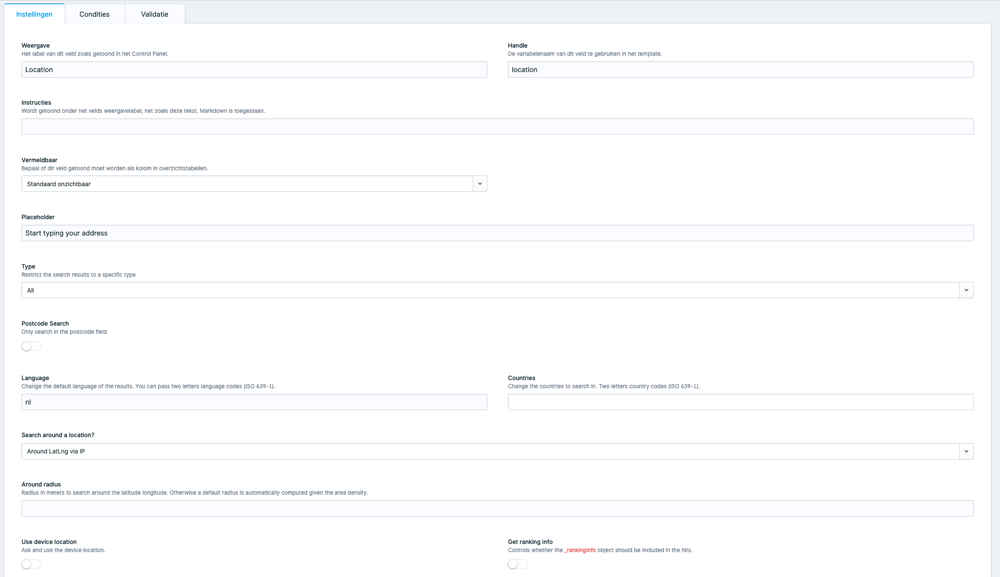

[](https://github.com/spatie/statamic-responsive-images/releases)


# Algolia Places

> Algolia Places fieldtype for Statamic 3.

## Support us

[](https://spatie.be/github-ad-click/statamic-algolia-places)

We invest a lot of resources into creating [best in class open source packages](https://spatie.be/open-source). You can support us by [buying one of our paid products](https://spatie.be/open-source/support-us).

We highly appreciate you sending us a postcard from your hometown, mentioning which of our package(s) you are using. You'll find our address on [our contact page](https://spatie.be/about-us). We publish all received postcards on [our virtual postcard wall](https://spatie.be/open-source/postcards).

## Installation

Require it using Composer.

```
composer require spatie/statamic-algolia-places
```

## Templating

The location field will contain the following data:

```yaml
location:
  name: 'Kruikstraat 22'
  administrative: Vlaanderen
  county: Antwerpen
  city: Antwerpen
  country: België
  countryCode: be
  type: address
  latlng:
    lat: 51.2088
    lng: 4.42386
  postcode: '2018'
  postcodes:
    - '2018'
  query: 'Kruikstraat 22'
  value: 'Kruikstraat 22, Antwerpen, Vlaanderen, België'
```

## Configuration

The fieldtype has all the [Algolia Places options](https://community.algolia.com/places/documentation.html#options)



### Changelog

Please see [CHANGELOG](CHANGELOG.md) for more information what has changed recently.

## Contributing

Please see [CONTRIBUTING](CONTRIBUTING.md) for details.

## Security

If you discover any security related issues, please email [freek@spatie.be](mailto:freek@spatie.be) instead of using the issue tracker.

## Credits

- [Rias Van der Veken](https://github.com/riasvdv)
- [All Contributors](../../contributors)

## License

The MIT License (MIT). Please see [License File](LICENSE.md) for more information.
